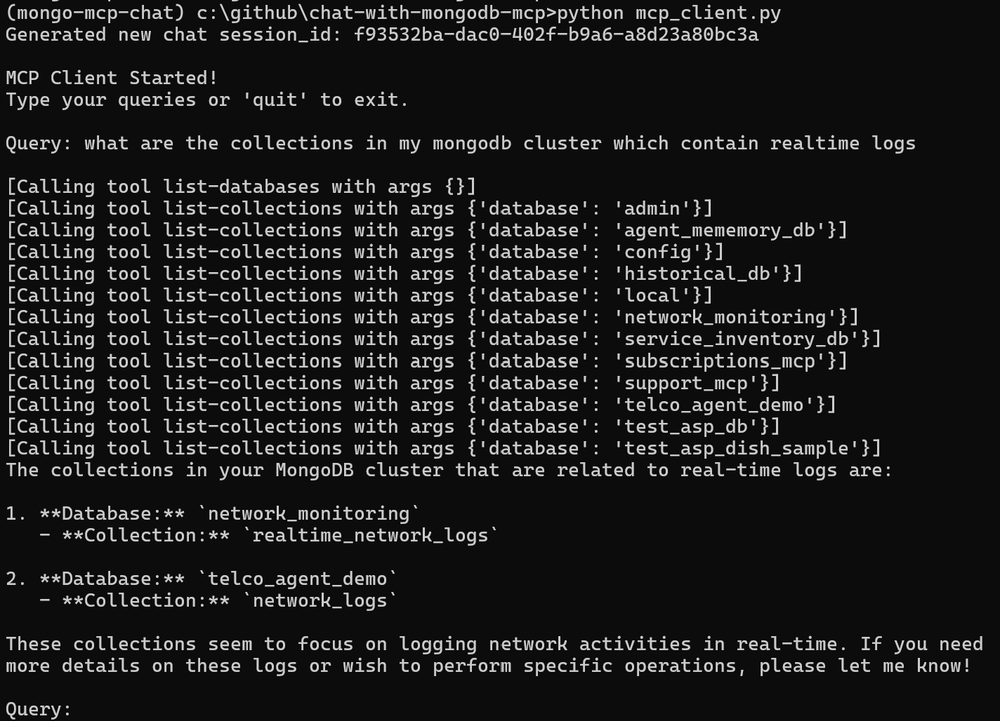

# chat-with-mongodb-mcp
create a .env file and populate the keys

```
OPENAI_API_KEY = ""
VOYAGE_API_KEY =""
ATLAS_VECTOR_SEARCH_INDEX_NAME = ""
MONGO_URI = ""  
DB_NAME = "network_monitoring"
COLLECTION_NAME = "realtime_network_logs"
```

1. python -m venv mongo-mcp-chat
1. mongo-mcp-chat\Scripts\activate.bat ( this for Windows, change for other OS)
1. pip install -r requirements.txt

# start sending ts data 


```
python send_data_to_ts.py
```


# start chat bot with memory and MCP tools 
```
python mcp_client.py
```

# output

chat history per session stored here

```
            database_name="historical_db",
            collection_name="chat_messages"
```


